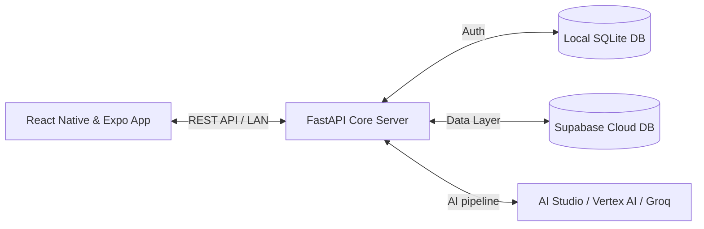

# FactoryMind AI (SmartFactory AI)

FactoryMind AI is a premium, high-fidelity command center dashboard for industrial manufacturing, designed to eliminate unplanned machinery downtime. Powered by a multi-agent orchestration pipeline, the system ingests raw telemetry and operator logs, diagnoses failures, detects data contradictions, runs financial impact assessments, plans physical mitigations, and runs digital-twin simulations.

---

## 1. Architecture Overview

The platform uses a decoupled, three-tier architecture:



### A. Mobile Client (React Native & Expo)
* Built with Expo, utilising folder-based routing (`Expo Router`) and a dark Glassmorphism UI theme.
* Handles CSV telemetry file loading and initial schema validation locally via `PapaParse`.
* Subscribes to global app states using `Zustand` to dynamically update active metrics, logs, and simulated values.

### B. Core Backend Server (FastAPI)
* Implements high-throughput asynchronous routes for uploading CSV streams, managing scenario states, and running the agent orchestrator.
* Utilises a local SQLite database (`smartfactory.db`) for low-latency user session registration and JWT login validations.

### C. Realtime Cloud Data Layer (Supabase)
* Uses a PostgreSQL relational database on Supabase to maintain global system integrity across multiple linked tables:
  * `scenarios` (State: `pending`, `running`, `complete`, `error`)
  * `agent_traces` (Reasoning steps, raw prompts, parsed model outputs)
  * `insights` (Machine risks, anomalies, and physical evidence)
  * `contradictions` (Conflicts between physical telemetry and human shift logs)
  * `actions` & `simulations` (Step-by-step mitigation plans and before/after metrics)

### D. Multi-Agent Orchestrator Pipeline
The orchestrator triggers five sequential, state-sharing agents powered by Google GenAI:

1. **Machine Health Agent**: Evaluates raw sensor data and outputs specific risk ratings.
2. **Contradiction Agent**: Matches shift logs against sensor readings to detect lies or scheduling mismatches.
3. **Demand Forecast Agent**: Analyzes stock levels, news events, and machine outages to predict downtime impact.
4. **Action Planner Agent**: Converts diagnostic insights into exact, categorized maintenance instructions.
5. **Simulation Agent**: Runs a digital twin loop to project system recovery and draft alerts (SMS/Email) to stakeholders.

---

## 2. Tools & APIs Used

### Backend & AI Stack
* **FastAPI (v0.115+) & Uvicorn**: Framework for hosting the REST endpoints.
* **google-genai (v0.1.1+)**: The Google Gemini SDK for connecting to standard models.
* **Vertex AI SDK**: Enterprise fallback provider when API Studio limits are exceeded.
* **Groq SDK**: Secondary fallback client running Llama-3.3-70b-versatile.
* **SQLAlchemy & SQLite**: ORM mapper and local auth database.
* **Supabase Python SDK**: API wrapper used to insert and query database tables.

### Mobile Frontend Stack
* **React Native & Expo (v54.0.33)**: App compiling engine.
* **Zustand (v5.0.13)**: Lightweight hook state store.
* **Axios (v1.16.1)**: HTTP client configured with dynamic base URLs.
* **PapaParse (v5.5.3)**: High-performance CSV reader.
* **react-native-svg (v15.12.1)**: Native vector library for loading telemetry charts and statuses.

---

## 3. How Antigravity is Used

The **Google Antigravity AI Coding Assistant** acted as the primary engineer to build, maintain, and polish the system:

* **Codebase Generation**: Authored the FastAPI middleware routes, Supabase service client connections, and React Native components from scratch.
* **Multi-Provider Fallback Routing**: Designed and implemented the API failover system within `gemini_client.py`, enabling the code to seamlessly switch backends upon hitting rate limits.
* **Debugging & Typings**: Resolved compilation blocks (such as the TypeScript Settings page font size mismatch) and React Native list render duplicate key warnings.
* **Quality & Performance Control**: Configured `.gitignore` policies to exclude massive compiler modules and environment variables, keeping repository clean and secure.

---

## 4. Assumptions & Requirements

* **Environment Configurations**:
  * A valid `.env` file must exist in `smartfactory-ai/backend/.env` with these parameters populated:
    ```bash
    SUPABASE_URL="https://your-project.supabase.co"
    SUPABASE_SERVICE_KEY="eyJhbGciOi..."
    GOOGLE_API_KEY="AIzaSy..."
    GOOGLE_PROJECT_ID="your-gcp-project"
    GROQ_API_KEY="gsk_..."
    ```
* **Network Requirements**:
  * The development computer running the Metro Server and the mobile client (physical phone or emulator) **must be on the exact same local subnet**.
  * The mobile app must have `EXPO_PUBLIC_API_BASE_URL` pointed to the computer's LAN IP address (e.g., `http://192.168.1.100:8000/api/v1`) rather than `localhost`.
* **Database Infrastructure**:
  * Supabase PostgreSQL schemas must be created matching the structure outlined in the test guide before running the agent orchestrator.
